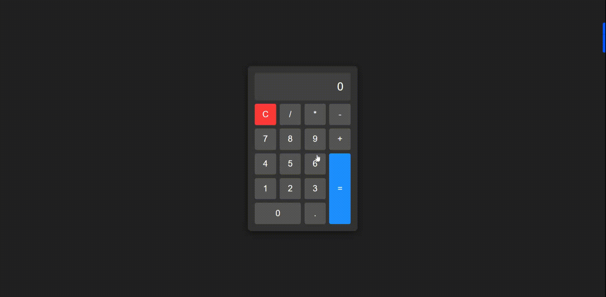
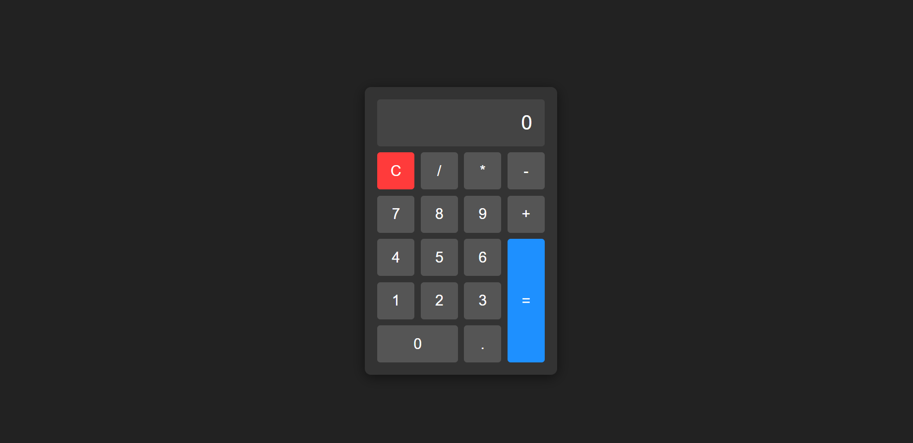

---

# Calculator App

This is a simple, JavaScript-powered calculator with a clean and modern UI, inspired by the look of the Windows Calculator. This calculator performs basic arithmetic operations and is designed to be user-friendly and visually appealing.

## Demo






## Features

- **Basic Arithmetic Operations**: Supports addition, subtraction, multiplication, and division.
- **Clear Function**: Quickly reset the display with a clear (`C`) button.
- **Chained Calculations**: Allows calculations to be performed consecutively without resetting.
- **Responsive Layout**: Optimized for desktop view.
- **Modern UI**: Styled with CSS for a sleek, professional look.

## Technologies Used

- **HTML**: Structure and layout of the calculator.
- **CSS**: Styling and layout with grid structure for a modern appearance.
- **JavaScript**: Functionality to handle arithmetic operations and update the display.

## Project Structure

```plaintext
├── index.html      # Main HTML file
├── styles.css      # Styling for the calculator
├── script.js       # JavaScript logic for operations
└── README.md       # Project documentation
```

## Setup Instructions

To run the calculator locally:

1. Clone the repository:
   ```bash
   git clone https://github.com/yasharyas/OdinProj-Calculator.git
   ```
2. Open the project folder:

   ```bash
   cd calculator-app
   ```

3. Open `index.html` in a web browser:
   ```bash
   start index.html  # Windows
   open index.html   # macOS
   ```

The calculator should load in your browser, ready to use.

## Usage

1. **Enter Numbers**: Click on the number buttons to enter numbers.
2. **Choose Operator**: Click on an operator (`+`, `-`, `*`, `/`) to perform a calculation.
3. **Equal Sign**: Click `=` to see the result.
4. **Clear**: Click `C` to reset the calculator.

### Example

To calculate `7 + 5`:

1. Click `7`.
2. Click `+`.
3. Click `5`.
4. Click `=`.

The display will show `12`.

## Customization

You can further customize the look of the calculator by adjusting values in `styles.css`. Experiment with different colors, font sizes, or grid dimensions to create a unique design.

## Contributing

Feel free to fork this repository and make improvements. Pull requests are welcome!

## License

This project is open source and available under the [MIT License](LICENSE).

---


